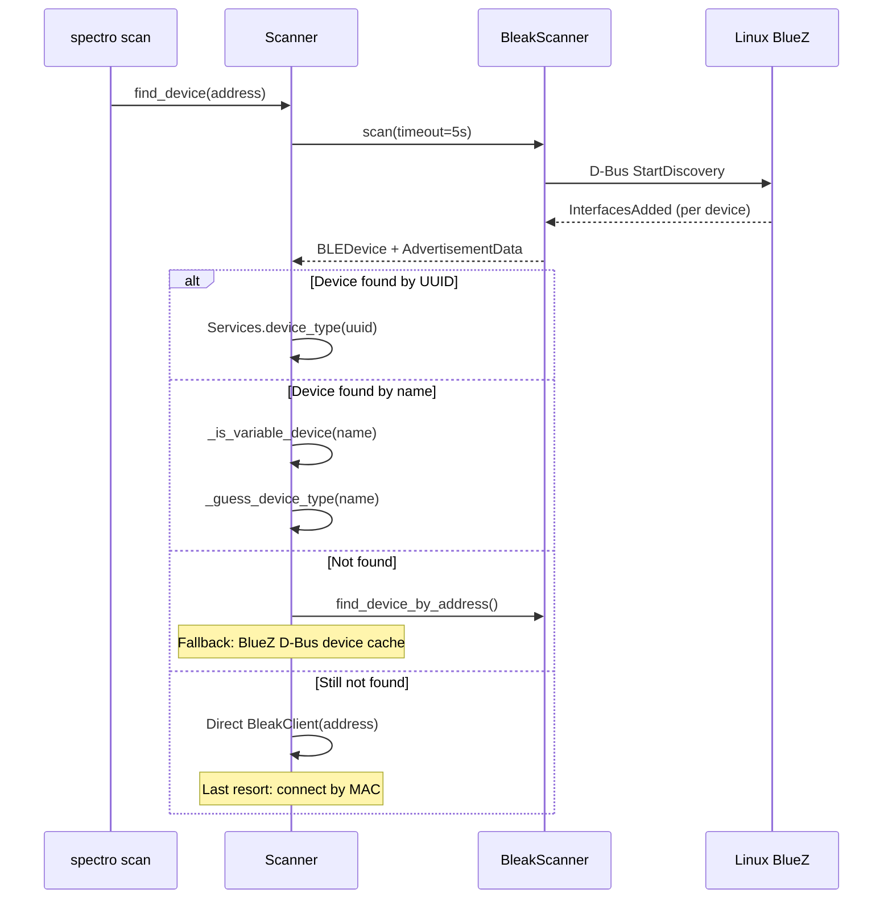
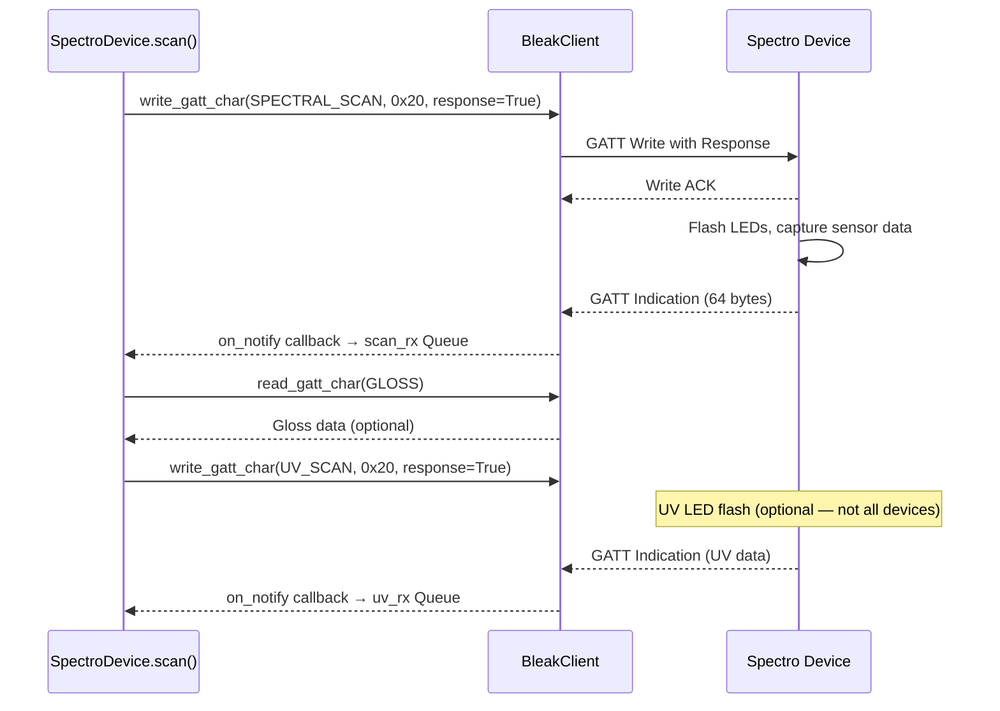
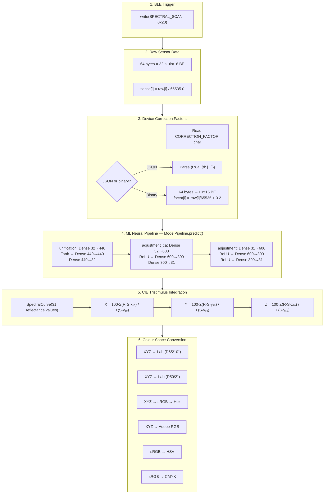
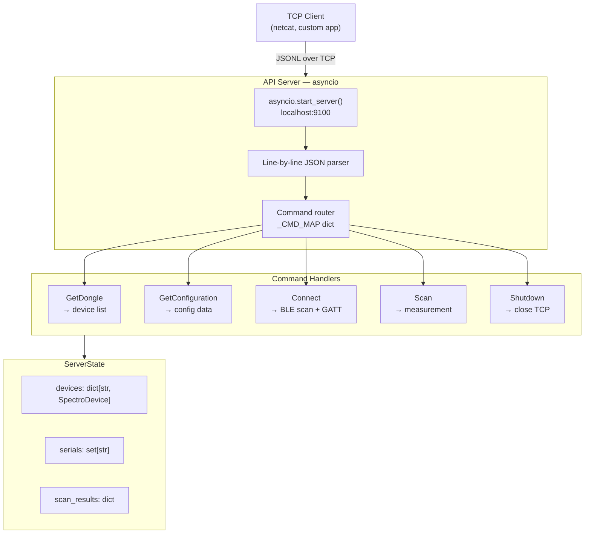
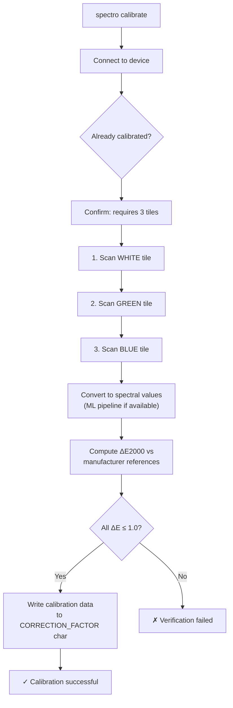
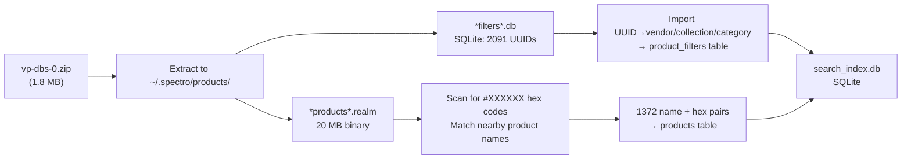

# Spectro — Architecture & Developer Guide

This document describes the inner workings of Spectro in detail. It assumes you've read the [README](README.md) for user-facing features.

---

## Table of Contents

1. [Project Structure](#project-structure)
2. [BLE Communication](#ble-communication)
3. [Measurement Pipeline](#measurement-pipeline)
4. [ML Neural Correction](#ml-neural-correction)
5. [Colour Science](#colour-science)
6. [BridgeKit API Server](#bridgekit-api-server)
7. [Calibration](#calibration)
8. [Product Database](#product-database)
9. [Configuration](#configuration)
10. [Testing](#testing)

---

## Project Structure

```
src/spectro/
├── __init__.py           # __version__ = "0.2.0"
├── cli.py                # 12 Typer CLI commands (510 lines)
├── config.py             # File-backed Config + APIConfig dataclasses
├── products.py           # ProductIndex — SQLite offline search (310 lines)
├── api_server.py         # BridgeKit-compatible JSONL TCP server (290 lines)
├── calibrate.py          # Spectro 1 three-tile calibration flow (170 lines)
├── models/
│   └── __init__.py       # Pure NumPy neural network inference (260 lines)
├── ble/
│   ├── __init__.py       # Package marker
│   ├── protocol.py       # Services/Chars/Descriptors UUIDs (110 lines)
│   ├── scanner.py        # Scanner + DiscoveredDevice (140 lines)
│   └── device.py         # SpectroDevice + dataclasses + parsers (570 lines)
└── color/
    └── __init__.py       # CIE tables, XYZ/Lab/SpectralCurve, colour spaces (430 lines)

tests/                    # 12 test files, 116 tests
pyproject.toml            # Hatchling build, ruff config, pytest settings
```

### Key Design Decisions

- **Zero install dependencies beyond bleak + typer + rich + numpy + httpx** — no TensorFlow, PyTorch, or ONNX Runtime required
- **Pure NumPy neural inference** — models converted from Core ML `.mlmodel` files at extraction time, stored as `.npz` weight files
- **Async throughout** — `bleak` is async-native; all BLE operations are coroutines
- **No GUI included by default** — `textual` is an optional dependency (`pip install spectro[gui]`)
- **File-backed configuration** — `~/.spectro/config.json` with Python dataclasses, loaded once at import

---

## BLE Communication

### Device Discovery



### Connection Flow

1. `BleakClient(ble_device, timeout=15s)` creates a BlueZ D-Bus client
2. `client.connect()` opens the GATT connection
3. `_enable_notifications()` subscribes to 9 characteristics via `start_notify()`
4. `_read_device_info()` reads serial, firmware, battery, scan counts, correction factors, and temperature from their respective characteristics

### Spectral Scan Protocol

The SPECTRAL_SCAN characteristic (`80db9d9a-...`) uses **GATT indication** (not notification). This requires:
- The write trigger to be sent **with response ACK** (`response=True`)
- The device flashes its LED array and returns 64 bytes (32 uint16 BE values) as an indication packet



### Error Handling

| Code | Name | Cause |
|---|---|---|
| `0x10` | shutter_closed | Device cap/shutter is closed |
| `0x01`–`0x03` | calibration_missing | Device needs recalibration |
| `0x04`, `0x08` | scan_error | Hardware measurement failure |

Errors arrive as notifications on the `Chars.ERROR` characteristic and are stored in `SpectroDevice.last_error`.

---

## Measurement Pipeline

The full pipeline from trigger to displayed colour values:



### Wavelength Range

- The Spectro device produces **32 sensor values** at ~12.5 nm intervals
- The pipeline uses indices **0–30** (31 values) covering **400–700 nm at 10 nm step**
- Index 31 is not used for CIE integration
- If fewer than 31 values are available, the last value is repeated (padding)
- If more than 31, they are trimmed

### CIE Tables

All colour-matching functions and illuminant SPDs are **exact copies** from the Android APK's `a.java`:

- **CMFs**: 50 points at 10 nm steps, covering 340–830 nm
  - `_CMF2_X/Y/Z`: CIE 1931 2° Standard Observer
  - `_CMF10_X/Y/Z`: CIE 1964 10° Supplementary Observer
- **SPDs**: 50 points at 10 nm steps, 340–830 nm
  - `_SPD_D50`, `_SPD_D65`, `_SPD_A`, `_SPD_F2`
- **White points**: 5 pre-computed reference points
- The 400–700 nm window is extracted using `_IDX_400NM=6` and `_IDX_700NM=37`

### XYZ Computation

```
K  = 100.0 / sum(S(λ) · ȳ(λ))
X  = K · sum(R(λ) · S(λ) · x̄(λ))
Y  = K · sum(R(λ) · S(λ) · ȳ(λ))
Z  = K · sum(R(λ) · S(λ) · z̄(λ))
```

Where R = reflectance, S = illuminant SPD, and x̄/ȳ/z̄ = observer CMFs.

---

## ML Neural Correction

### Model Architecture

The correction pipeline consists of three sequential feed-forward neural networks:

| Model | Input | Output | Architecture | Parameters |
|---|---|---|---|---|
| `unification` | 32 | 32 | D→T→D→D | 222,672 |
| `adjustment_ca` | 32 | 31 | D→R→D→D | 209,431 |
| `adjustment` | 31 | 31 | D→R→D→R→D | 208,831 |
| **Total** | | | | **640,934** |

D = Dense (fully connected), T = Tanh, R = ReLU.

### Model Download

Models are fetched from Variable's **public** S3 bucket:

```
https://gdn.colourcloud.net/s3/colorcloud.io/spectro_one/model_packages_v2/zips/ios/{SERIAL}.zip
```

This URL is **unauthenticated** — no API key or session token required. Each ZIP contains:

- `unification.mlmodel` — Core ML neural network
- `adjustment_ca.mlmodel`
- `adjustment.mlmodel`
- `info_v2.json` — pipeline configuration, verification data, model metadata

### Model Extraction

The Core ML `.mlmodel` files are Apple's proprietary format. The extraction process:

1. `coremltools.models.MLModel(mlmodel_path)` loads the model spec (no macOS required — this is protobuf parsing, not ML runtime)
2. `spec.neuralNetwork.layers` is iterated to find `innerProduct` layers
3. Weights (`floatValue`) and biases are extracted as NumPy arrays
4. Saved as `.npz` files for fast loading — no `coremltools` dependency at inference time

### Pure NumPy Inference

```python
class _DenseLayer:
    def forward(self, x: np.ndarray) -> np.ndarray:
        return x @ self.W.T + self.b  # [batch, in] → [batch, out]
```

Each model is a `NumpyModel` with a list of `("dense", layer)`, `("relu", None)`, or `("tanh", None)` tuples. Inference is a simple loop calling each layer's forward pass.

**Performance**: ~0.6 ms per full pipeline (three models sequentially) on a single CPU core.

### Model Verification

The `info_v2.json` includes test samples for each model (input = all 0.5, expected output values). Our tests verify each model independently against these samples to **1e-5 tolerance**.

---

## Colour Science

### Illuminants and Observers

```python
class Illuminant(Enum):
    D50 = "D50"  # Horizon daylight, 5000K
    D65 = "D65"  # Noon daylight, 6500K — APK default
    A   = "A"    # Incandescent tungsten
    F2  = "F2"   # Cool white fluorescent

class Observer(Enum):
    TWO_DEGREE = "TWO_DEGREE"  # CIE 1931
    TEN_DEGREE = "TEN_DEGREE"   # CIE 1964 — APK default
```

### Colour Spaces

| Function | Input | Output |
|---|---|---|
| `xyz_to_srgb(x, y, z)` | XYZ 0–100 | sRGB 0–255 |
| `xyz_to_adobergb(x, y, z)` | XYZ 0–100 | Adobe RGB 0–255 |
| `srgb_to_hsv(r, g, b)` | sRGB 0–255 | H° 0–360, S% 0–100, V% 0–100 |
| `srgb_to_cmyk(r, g, b)` | sRGB 0–255 | C% M% Y% K% 0–100 |
| `srgb_to_hex(r, g, b)` | sRGB 0–255 | `"#rrggbb"` |

### Delta-E

- `Lab.delta_e_76(other)` — CIE 1976 Euclidean distance: √((L₁−L₂)² + (a₁−a₂)² + (b₁−b₂)²)
- `Lab.delta_e_00(other)` — CIEDE2000: the modern standard with hue-dependent weighting, chroma interaction, and rotation terms

### Chromatic Adaptation

`XYZ.to_xyz(dst_illuminant)` performs **Bradford adaptation** to convert between illuminants (e.g., D50 → D65). The 3×3 Bradford matrix and its inverse are hardcoded from the CIE specification.

---

## BridgeKit API Server

The API server implements the [Bridge by Variable](https://bridge.vrbl.cloud/#/) protocol over TCP. We cover the core device-control commands (scan, connect, measure) without requiring the proprietary Bridge dongle or license files — see the README for a full coverage matrix.

### Protocol

- **Transport**: TCP socket, `\n`-delimited JSON (JSONL)
- **Default**: `localhost:9100`
- **Commands**: case-insensitive, `{"command": "...", "parameters": {...}}`
- **Responses**: `{"event": "...", "payload": {...}}` or `{"event": "...", "error_code": "vi-*", "payload": {...}}`

### Server Architecture



### Error Codes

| Code | Meaning |
|---|---|
| `vi-invalid-parameters` | Missing or malformed parameters |
| `vi-invalid-json` | JSON parse error |
| `vi-unknown-command` | Command not in `_CMD_MAP` |
| `vi-internal-error` | Unhandled exception in handler |
| `vi-bluetooth-device-not-connected` | Requested serial not connected |
| `vi-connection-timed-out` | BLE connection failed |
| `vi-scan-failed` | Measurement hardware error |

### Scan Response Format

The `Scan` response matches the BridgeKit specification:

```json
{
  "event": "Scan",
  "payload": {
    "serial": "DEVICE123",
    "device_type": "spectro",
    "batch": "s1-2",
    "model": "11.0",
    "scan_count": 180,
    "start": 400,
    "step": 10,
    "curve": [0.39, 0.54, ...],
    "sense_values": [0.44, 0.49, ...],
    "hex": "#c6dec6",
    "lab": {"L": 86.1, "a": -12.1, "b": 8.1, "illuminant": "d65", "observer": "10°"},
    "gloss": {"id": "gloss_v5", "gloss": 0.25, ...},
    "created_at": 1718390400
  }
}
```

---

## Calibration

### Spectro 1 Flow



### Verification Data

Manufacturer reference data is hardcoded from the APK's `info_v2.json`:

```python
_VERIFICATION_WHITE  = [0.701, 0.708, 0.707, ...]  # 31 values, 400-700nm
_VERIFICATION_GREEN  = [0.138, 0.132, 0.141, ...]
_VERIFICATION_BLUE   = [0.631, 0.650, 0.654, ...]
_VERIFICATION_TOLERANCE = 1.0  # CIEDE2000
```

### Data Encoding

Calibration data written to the device is encoded as:

```python
for value in sense_values[:32]:
    encoded = int(round((value - 0.2) * 65535))
    # clamped to [0, 65535], packed as uint16 BE
    buf.extend(struct.pack(">H", max(0, min(65535, encoded))))
```

This matches the APK's `ByteUtilities.charToByteArrayBE((char) Math.round((d - 0.2d) * 65535.0d))`.

---

## Product Database

### Data Sources

The product database ZIP contains two files:

| File | Format | Contents |
|---|---|---|
| `*filters*.db` | SQLite | 9,722 filter entries: UUID → vendor, collection, category, brand, location |
| `*products*.realm` | Realm B-tree | 1,372 product entries: name + hex colour |

### Index Building



### Search

```sql
SELECT name, hex_color, vendor, collection, category
FROM products
WHERE name LIKE '%query%'
   OR hex_color LIKE '%query%'
   OR vendor LIKE '%query%'
ORDER BY name
LIMIT 50
```

The vendor column populates when a product UUID extracted from the realm file matches a filter DB entry. Currently, UUID extraction from the Realm B-tree is not fully implemented — the column is present in the schema for future use.

---

## Configuration

### File Format

```json
{
  "session_token": "",
  "subscription_id": 0,
  "b2_access_key": ""
}
```

Located at `~/.spectro/config.json`. Loaded once at import time via `Config().load()`.

### Override Hierarchy

1. CLI flags (`--token`, `--sub-id`)
2. Environment variables (`SPECTRO_SESSION_TOKEN`, `SPECTRO_SUBSCRIPTION_ID`)
3. Config file (`~/.spectro/config.json`)
4. Defaults (empty string / 0)

### Data Directory

```
~/.spectro/
├── config.json              # API credentials
├── models/
│   └── {SERIAL}/
│       ├── info_v2.json      # Pipeline configuration
│       ├── *.mlmodel          # Core ML model files
│       └── *_weights.npz      # Extracted NumPy weights
└── products/
    ├── search_index.db       # Product search SQLite index
    ├── vp-dbs-0.zip           # Downloaded product database
    └── 0.realm                # Extracted Realm file (temporary)
```

---

## Testing

### Test Structure

```
tests/
├── test_api.py         # 18 tests — BridgeKit commands, JSONL protocol, error codes
├── test_calibrate.py   # 15 tests — ΔE, verification data, spectral conversion, encoding
├── test_color.py       # 16 tests — White points, XYZ↔Lab, CIEDE2000, spectral curves, sRGB
├── test_config.py      #  8 tests — Save/load, edge cases, corrupt files
├── test_device.py      # 17 tests — Serial, firmware, battery, charging, correction, errors
├── test_models.py      #  7 tests — Dense layer, activations, full network, weight verification
├── test_products.py    #  6 tests — Schema, count, search, is_built
├── test_protocol.py    #  7 tests — Service UUIDs, device type detection, descriptors
└── test_scanner.py     # 19 tests — Name detection, UUID detection, type guessing, scanning
```

### Running Tests

```bash
pytest tests/ -v                    # all 116 tests
pytest tests/test_color.py -v       # single file
pytest tests/ -v --cov=spectro      # with coverage
pytest tests/ -v -k "test_scan"     # filter by name
```

### Test Philosophy

- **No hardware required** — BLE and device tests use pure data parsing
- **No network calls** — config tests use tempfile, model tests verify extracted weights
- **Deterministic** — no flaky tests, no time-dependent assertions beyond `pytest.approx()`
- **Model verification** — ML weights are validated against known input/output pairs from the APK's `info_v2.json`
