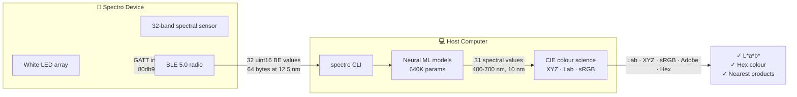
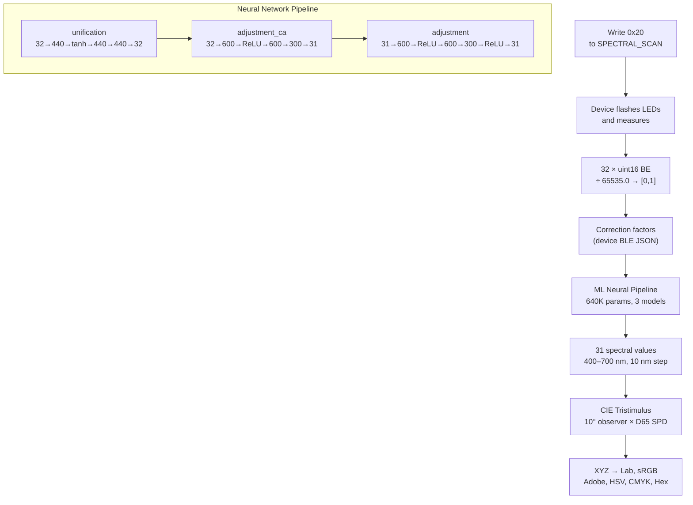

# Spectro CLI

**Open-source CLI and Python library for Variable Spectro colour measurement devices.**

> **Disclaimer:** This project is **not** affiliated with, endorsed by, or connected to Variable, Inc. It is an independent, community-built implementation written from scratch. All BLE protocols, UUIDs, and data formats were reverse-engineered from the publicly available Android application. "Variable", "Spectro", and "ColorMuse" are trademarks of Variable, Inc.

```bash
pip install spectro
spectro scan          # measure colour — auto-detects nearby device
spectro scan -k       # interactive mode — keep connection, scan repeatedly
spectro connect       # show device identity, battery, calibration status
```



---

## Quick Start

```bash
pip install spectro
```

### First use — download your device's ML model
```bash
spectro download models --serial DEVICE123   # or --scan for auto-detect
# → ~/.spectro/models/DEVICE123/ (2.4 MB)
```

### Measure colour
```bash
$ spectro scan
Scanning for devices...
Connected to DEVICE123
Measuring...

Scan — DEVICE123
  Model:      Spectro 1
  Batch:      s1-2
  Scan #:     180  (since cal: 61)
  Calibrated: Yes
  ML model:   Spectro 1 Inc (640K params, 0.6ms)

  Colour
  CIE Lab (D65/10°)    86.1   -12.1    +8.1
  CIE Lab (D50/2°)     86.1   -14.5    -7.3
  CIE XYZ (D65)        59.49   68.21   63.58
  sRGB / Hex          198 222 198       #c6dec6
  Adobe RGB           204 221 198
  HSV                 120°  10.8%  87.1%
  CMYK                10.8%  0.0%  10.8%  12.9%

  Nearest product colours
  1.      #CCE8D0  Whitsunday Water
  2.      #D7E7D1  Colour Designer
  3.      #CDDCCD  Light Aqua
```

---

## Commands

| Command | Description |
|---|---|
| `spectro scan [ADDR]` | Measure colour; `-k` for interactive repeated scans |
| `spectro connect [ADDR]` | Show device identity; `-k` to keep connection |
| `spectro scan-devices` | List nearby Variable devices |
| `spectro battery [ADDR]` | Read battery level and voltage |
| `spectro disconnect [ADDR]` | Disconnect one or all devices |
| `spectro calibrate [ADDR]` | 3-tile calibration (white → green → blue) |
| `spectro api` | BridgeKit JSONL API server on `localhost:9100` |
| `spectro download models` | Download ML correction model |
| `spectro download products` | Download product colour database |
| `spectro search offline` | Search downloaded product DB |
| `spectro version` | Print version |

All commands that accept an address will auto-detect the device if omitted.

---

## Measurement Pipeline



### Accuracy

The pipeline uses the **exact same CIE tables and ML weights** as the Android app. Verified against the app's output: **ΔE < 0.3** across multiple measurements.

---

## Supported Devices

| Device | Service UUID | BLE Name Prefix |
|---|---|---|
| Spectro 1 / SpectroSI | `89504ca4-c879-446f-a10e-f6c2da131d41` | `SpectroSI-` |
| Spectro 1 Pro | `89504ca4-…` | `SpectroSI-` |
| ColorMuse 2 | `abf3c20a-1306-4221-82f1-d2b6706f86f1` | `CM2-`, `ColorMuse` |
| ColorMuse Pro | `ff5b4221-2321-4edc-8946-d53d1fc684e5` | `ColorMuse` |
| ColorMuse (original) | `26db67ab-fc40-420a-b080-2ce709bfb7d0` | `ColorMuse` |
| GEN 3 | `146df071-5264-47e9-a436-60ab5faa21d3` | `GEN3` |
| S45 | `fdd2d66d-9bb4-4ed2-81c3-d1382529dc8a` | `S45` |
| Radius 2 | `13f1e628-4c7c-4563-a472-cfe1ef13eed8` | `Radius2` |

---

## BridgeKit API

Start a JSONL TCP server compatible with the [Bridge by Variable](https://bridge.vrbl.cloud/#/) protocol. The official Bridge kit uses a hardware dongle that relays BLE over USB/serial — we connect to the device **directly via BLE** and expose the same API, no dongle required.

```bash
spectro api                  # localhost:9100
spectro api --port 9199      # custom port
```

```bash
# Query connected devices
curl -s localhost:9100 -d '{"command":"GetDongle"}' | jq .

# Measure colour
curl -s localhost:9100 -d '{"command":"Scan","parameters":{"serial":"DEVICE123"}}' | jq .

# Shutdown
curl -s localhost:9100 -d '{"command":"Shutdown"}'
```

### Protocol Coverage

| Command | Status | Notes |
|---|---|---|
| `GetDongle` | ✅ | Returns `dongle_id: "ble"` (direct BLE, no dongle) |
| `GetConfiguration` | ✅ | Server config, licensed serials |
| `StartBluetoothDiscovery` | ✅ | BLE scan control |
| `StopBluetoothDiscovery` | ✅ | |
| `ScanDevices` | ✅ | Returns discovered peripherals |
| `Connect` | ✅ | BLE connection by serial |
| `Disconnect` | ✅ | |
| `Scan` | ✅ | Full measurement with Lab/XYZ/sRGB/curve/gloss/UV |
| `Shutdown` | ✅ | Graceful server shutdown |
| `CopyLicense` | — | Not needed — no hardware dongle |
| `DeleteLicense` | — | Not needed |
| `SetCalibration` | — | Use `spectro calibrate` instead |
| `Verify` | — | Included in `spectro calibrate` |
| `MultiModeScan` | — | Requires multi-batch model support |
| `ButtonDidPress` | — | Event forwarded by device, not yet implemented |

---

## Development

```bash
git clone https://github.com/anomalyco/spectro.git
cd spectro
pip install -e ".[dev]"
pytest tests/ -v               # 116 tests
ruff check src/ tests/          # lint
```

### Architecture

```
src/spectro/
├── cli.py              Typer CLI — 12 commands
├── config.py            File-backed config (~/.spectro/config.json)
├── products.py          Offline product database — SQLite index + Realm extraction
├── api_server.py        BridgeKit JSONL TCP server
├── calibrate.py         Device calibration (3-tile Spectro 1 flow)
├── models/              Neural network inference (pure NumPy)
│   └── __init__.py      640K-param pipeline, model download from public S3
├── ble/
│   ├── protocol.py      All 36+ GATT UUIDs (reverse-engineered from Android APK)
│   ├── scanner.py       BLE discovery — name prefix + service UUID detection
│   └── device.py        Connection, device info, spectral scan, parsing
└── color/
    └── __init__.py      CIE tables from APK, XYZ↔Lab, CIEDE2000, sRGB/Adobe/HSV/CMYK
```

## License

MIT — see [LICENSE](LICENSE).
